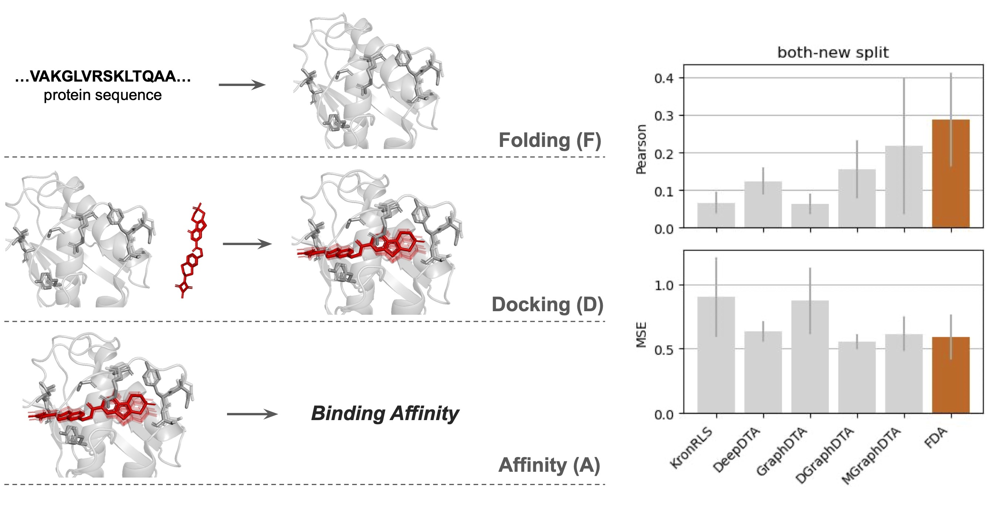

## Overview

$\color{red}{\textsf{Please note that the  repository is for reference purposes only. We do not guarantee its active functionality. A user-friendly version is currently under development.}}$


Folding-Docking-Affinity (FDA) is a framework which folds proteins, determines protein-ligand binding conformations, and predicts binding affinities from computed three-dimensional protein-ligand binding structures.
<p align="center">
    
    
## Dependencies
The Folding part was tested with Python 3.10.13 and CUDA 12.3 on Ubuntu 20.04, with access to Nvidia Tesla V100 (32GB RAM), Intel(R) Xeon(R) Platinum 8168 CPU @ 2.70GHz, and 1.5TB RAM. Please follow [localcolabfold](https://github.com/YoshitakaMo/localcolabfold) to install the working environment. 

The Docking and Affinity parts were tested with Python 3.9.18 and CUDA 11.5 on CentOS Linux 7 (Core), with access to Nvidia A100 (80GB RAM), AMD EPYC 7352 24-Core Processor, and 1TB RAM. Run the following to create a conda environment, FDA.

```
conda create --name FDA python=3.9
conda activate FDA
conda install conda-forge::pymol-open-source
conda install pytorch==1.11.0 torchvision==0.12.0 torchaudio==0.11.0 cudatoolkit=11.3 -c pytorch
pip install scipy
pip install --no-index pyg_lib torch_scatter torch_sparse torch_cluster torch_spline_conv -f https://data.pyg.org/whl/torch-1.11.0+cu113.html
pip install torch_geometric
python -m pip install PyYAML scipy "networkx[default]" biopython rdkit-pypi e3nn spyrmsd pandas biopandas
```
## Datasets
Download the processed data for replicating benchmark and ablation study results from [zenodo](https://zenodo.org/records/10968593) and decompress the files

```
tar -xvzf benchmark.tar.gz
tar -xvzf ablation_study.tar.gz
```

Create a directory `/data`, place them in the directory and follow the following file structure.
### File structure

```
|--data
   |--ablation_study
      |--crystal_crystal
      |--crystal_diffdock
      |--colabfold_diffdock
      |--train.csv
      |--valid.csv
      |--test.csv
   |--benchmark
      |--complex
      |--davis_colabfold_protein
      |--davis_ligand
      |--davis_data.tsv
```

 
## Replicate results
### Affinity prediction benchmark
#### Folding 
Use ColabFold to generate three-dimensional protein structures. Please follow [localcolabfold](https://github.com/YoshitakaMo/localcolabfold) to install the working environment. Or directly download the processed data from [zenodo](https://zenodo.org/records/10968593/files/benchmark.tar.gz?download=1) and place them in `/data` directory and jump to the last step.

```python
python folding/create_davis_protein_input.py
colabfold_batch --templates --amber folding/input/davis_protein.csv folding/output/davis_colabfold_protein --use-gpu-relax --num-relax 1 --gpu 0

```
#### Docking
Create protein-ligand complex directories

```
conda activate diffdock
python docking/create_dir.py
```
Implement DiffDock to generate ligand binding poses. Download ESM2 embedding from [zenodo](https://zenodo.org/records/10968593/files/esm2_3billion_embeddings_davis_colabfold.pt.tar.gz?download=1) and place the file in `docking/DiffDock/data/`. The process of generating ESM2 embedding could refer [DiffDock](https://github.com/gcorso/DiffDock/tree/v1.0)

```
cd docking/DiffDock
python -m affinity.dataset_davis_colabfold --run_name davis_colabfold --inference_steps 20 --samples_per_complex 10 --batch_size 10 --ns 12 --nv 6 --num_conv_layers 3 --dynamic_max_cross --scale_by_sigma --dropout 0.2 --remove_hs --c_alpha_max_neighbors 24 --receptor_radius 15 --gpu_num 6
```

Add DiffDock-generated ligand poses into original complex directories.

```
cd ../../
python docking/update_dir.py
```

#### Affinity
Pre-process protein-ligand complexes and generate inputs for GIGN.

```
conda activate pymol
python affinity/GIGN/preprocessing.py
conda activate diffdock
cd affinity/GIGN
python dataset_GIGN_benchmark.py
```

Train GIGN to predict binding affinity under different split_methods (drug, protein, both, and seqid).

```
python train_GIGN_benchmark.py --split_method drug
```
### Ablation study
Download the processed data from [zenodo](https://zenodo.org/records/10968593/files/ablation_study.tar.gz?download=1) and place them in `/data`. Train GIGN to predict binding affinity under three different scenarios (crystal\_crystal, crystal\_diffdock, and colabfold\_diffdock).

```
cd affinity/GIGN
python train_GIGN_ablation.py --scenario crystal_crystal
```
